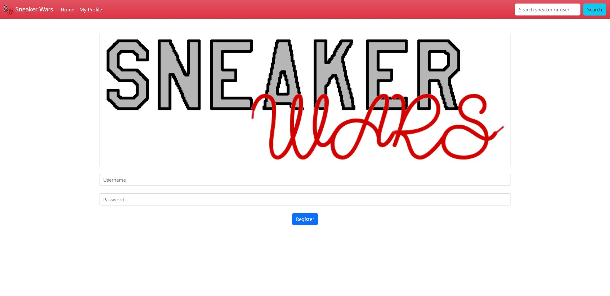
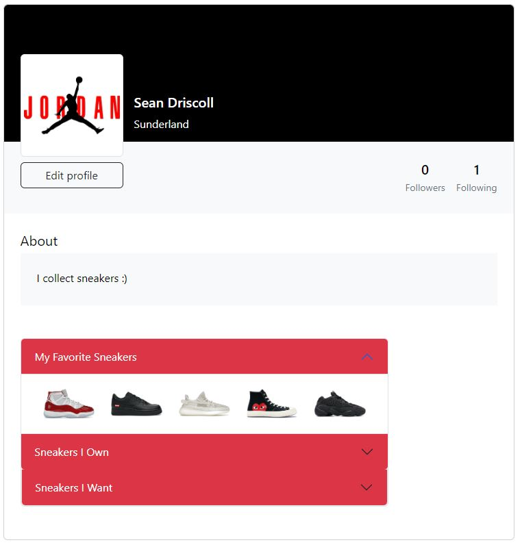
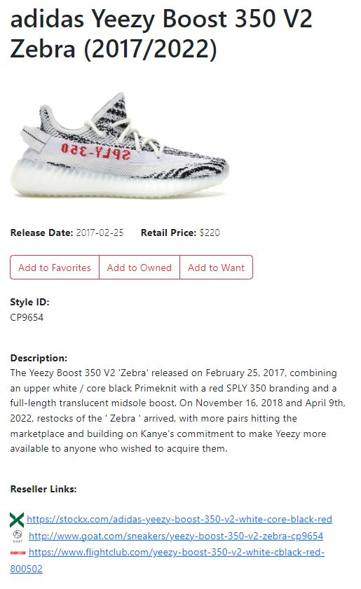
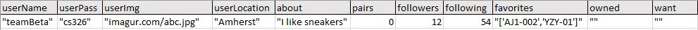

# Team Beta
## Sneaker Wars
### Fall 2022
**Project Overview:** For our project, Sneaker Wars, we wanted to create a site where sneaker enthusiasts could go to create and prsonalize a profile of all their favorite sneakers, their own prized collection, and all of their dream kicks.
## Team Members
Sean Driscoll | seand391 & spdriscoll  
Rupin Mehra   | rupin27
## User Interface
### Login page  
Used for the user to optionally log into their account so they can view and update their profile. Also includes an option to register for a new account if they do not yet have one.

### Register page  
Used to register for a new user account

### User profile page
Lets users view their profile and see all their information and sneaker lists if they are logged in  

### Sneaker Viewer page
Displays an image and some useful information about a sneaker after the user either searches for it or clicks on it from their profile lists  

## API
/createAccount  
creates a new user account with spceified userName and userPass if no other account exists with that userName  

/updateAccount  
updates specified fields in account. paramaters are user, pass, and any fields the user wants to update (see database section for all possible fields)

/removeAccount  
removes account with specified userName and userPass

/readAccount  
get the information for account with specified user and pass

## Database

  
userName: username for account, must be unique
userPass: password for account
userImg: profile picture for account
userLocation: location to display in user profile
about: description/bio for user profile
pairs: number of pairs of sneakers the user owns
followers: number of followers user has
following: number of other users the user is following
favorites: list of sneaker IDs for user's favorite sneakers
owned: list of sneaker IDs for user's collection
want: list of sneaker IDs for sneakers the user wants  

## URL Routes
/index.html: serves the main login page  

/sneakerview.html?shoeName=`shoe name here`: serves sneaker viewer for the shoe name specified in the query

## Authentication/Authorization

Users must be logged in with their username and password to add shoes to their profile

## Division of Labor

Sean: Created html and js files for milestone 1, created server, heroku, and database, set up routes and endpoints for server, made all crud operations for database user table, made sneaker viewer page with the sneaks API, made user profile generate from database information, made markdown files, made final video

