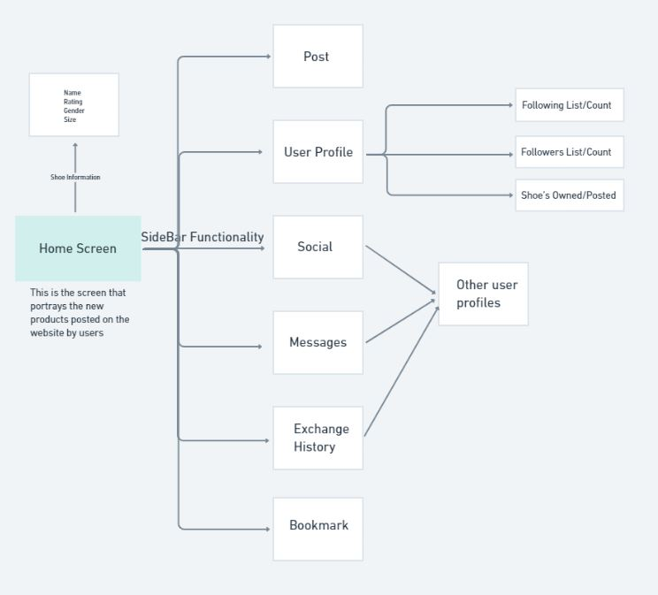

# TEAM NAME

* team-beta

# WEB APPLICATION NAME

* Sneaker Wars

# Team Overview

* Rupin Mehra, rupin27 
* Sean Driscoll, seand391
* Chriag Chavadi, ChiragMC

# Innovative Idea

Why trade NFT’s when you can trade those fresh pairs of Trainers? Introducing “Sneaker Wars” where you can create an account and get your shoes on the market. Create your profile and interact with all other traders and browse through the hottest pairs on the market and learn more about them. The website would allow you to create a list of shoes you own, shoes you used to own, and shoes you want which could be added to your favorite list. User profiles would include the list of traders and friends you have exchanged in the past so you can explore their profiles in the future. Boast your collection and share your taste with the world, maybe cop a fresh pair for yourself! Filter from thousands of colors, sizes, and brands. Barter, sell, and be a part of the war!

# Important Data

For Sneaker Wars we could have users log in to create/edit their own profile and interact via comment/rating/like/friend, but be able to view others profiles and sneaker info without having to log in. this would make it easy to give someone your profile url and let them see your collection/activity without them needing to sign up. In your user profile, you can create a list of shoes you own, shoes you used to own, shoes you want, shoes you're trading, and favorite shoes. along with these lists, user profiles could include a profile picture, bio, friend list, and user name. we can also make a page for each sneaker using information from StockX or a similar sneaker market's API including info like retail price, release date, image, name & colorway... etc.

# User Interface

Wireframe for the site

Log in / sign in on the home page

Navigation bar on each page for easy access

Create a Post to share your new sneakers with the world

Social tab to interact with all your friends and see what's new on the market

History of recent follows, likes, trading activity, etc.

Bookmarks for the sneakers you want to come back to later

User profile to admire your own collection and make sure people know what you're about

Messages system to contact other enthusiasts whether just to chat or close a deal

